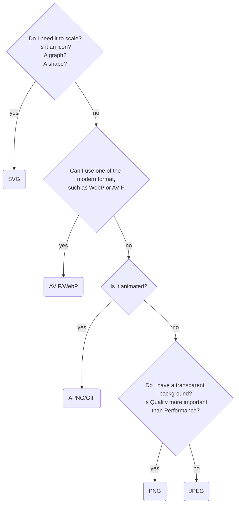

---
title: 'Web Image Format JPEG, PNG, WebP - Which one to choose ?'
description: Which image format should you use?
status: published
tags:
  - web
created_at: 2023-01-12T09:38:00.000Z
last_modified_at: 2023-01-19T02:16:00.000Z
publish_at: '2023-01-12 19:37'
lang: en-AU
slug: til-web-image-format-which-one-to-choose
published_at: 2023-02-22T05:47:02.758Z

--- 
There are a lot of images format available for the Web!

The most common are APNG, AVIF, GIF, JPEG, PNG, SVG and finally, WebP.

Image format are not the most exciting part of the web, but you should pay attention to it.
While we strive to reduce our files by minifying, uglyfing, tree-shaking, lazy loading, splitting, islanding, we often forget a huge culprit for web page sizes: images.

So today I decided to take a few minutes to write about images format.

Which one should you use, and why?

# Definitions
Before we start, let's define a few terms so we are on the same page.

# Still vs. Animated

Straightforward, a still format is ... still. Think about a photo.
On the other end, an animated format is ... animated. Like these GIFs/memes we send each other on group discussion!

# Raster vs. Vector

Raster images are built from pixels. This what you commonly see when you look at a photo on your screen: the photo is composed of thousand upon thousand pixels, each of them of a different colors, composing an image.

!photo-1634320714682-ae8b9c9cee60.jpeg

This picture is a good represenstation of a raster image.
Although it's only composed of individual 'pixel-like' colored elements, you can see a picture.

Vector on the other hand composes image using mathematics.

Using equations to compute lines, curves and fixed points, the computer can draw an image.
The advantage is that the image is sharp and remain sharp no matter the size.
ou can change its size, zoom, move it around - it will remain sharp since the image can be recomputed from its mathematical definition.
It makes it a perfect candidate for icons, graphs and other shaped formed images.

!vector vs raster.png

The main drawback of the vector format is the cost to render the image, it requires much more power since we need to compute the image.

# Lossy vs. Lossless Compression

Images served on the internet are often - if not always - compressed.
There are two ways to compress images: lossy and lossless algorithms.

Lossy algorithms reduces sizes by permanently removing some of the original data, often by 'merging' multiple pixels together.
Lossless reduces the size without removing the original data - only the met - only the metadata. 

As you can imagine, lossy algorithms are much more efficient, since they remove more data from an image.

# Common Image Format

## APNG - Animated Portable Network Graphics

Not very common as far I have experienced. I have never used it myself.
This one is meant to be a good choice for lossless, animated images. 

To keep simple, it's a more performant GIF alternative.

## AVIF - AV1 Image File Format

AVIF, along with [WebP](#WebP) belongs to the newer, modern file formats.

It is a lossy format that offer a better compression than PNG and JPEG, with support for higher color depth, animated frames (i.e. GIF-like) and transparency.

It's not very well supported, at this stage Edge (v108) does not support it, and Safari is partially supporting it (v16.3).
If using AVIF, you should use a fallback in case the browser does not support the format.

## GIF - Graphic Interchange Format

A classic, we are all familiar with it.
It's simple and widely supported which makes it still relevant when the other alternatives are not possible.
However, you should prefer [ANPG](#ANPG), [AVIF](#AVIF) or [WebP](#WebP) when available as they are much more performant.

## JPEG - Joint Photographic Expert Group Image

Currently the most popular format for lossy still images!
If you wish to serve lossless image, [PNG](#PNG) is prefered - or even better [WebP](#WebP) or [AVIF](#AVIF) if they are supported.

## PNG - Portable Network Graphic

Currently the most popular for lossless still images!
Again, if possible use [WebP](#WebP) or [AVIF](#AVIF) for increased performance.

## SVG - Scalable Vector Graphic

SVG is the only a vector image format in this list.

If you need a vector based image, such as icons, graphs, shapes, digital illustrations ... Then SVG is your main candidate.

## WebP

With [AVIF](#AVIF), WebP is one of the newer, modern image format available.

WebP has been developped by Google and supports both lossy and lossless format.
It also supports animated frames (such as GIF) and transparency.
It is more performant than  all the other formats, except for [AVIF](#AVIF). 

It has better support than AVIF and is supported by most browsers, including less popular browsers such as Opera.

Because of its performance and abililty to support lossless, lossy, animated and transparency, It makes it a very relevant choice when available.

It is my go-to format when possible, and I strongly believe it will replace PNG, JPEG and GIF in the future.

# How to Choose?

As always, it depends on the situation.
This is the 'algorithm' I use when choosing which format to use:

That's it for image format!

See you soon 👋,
Alo